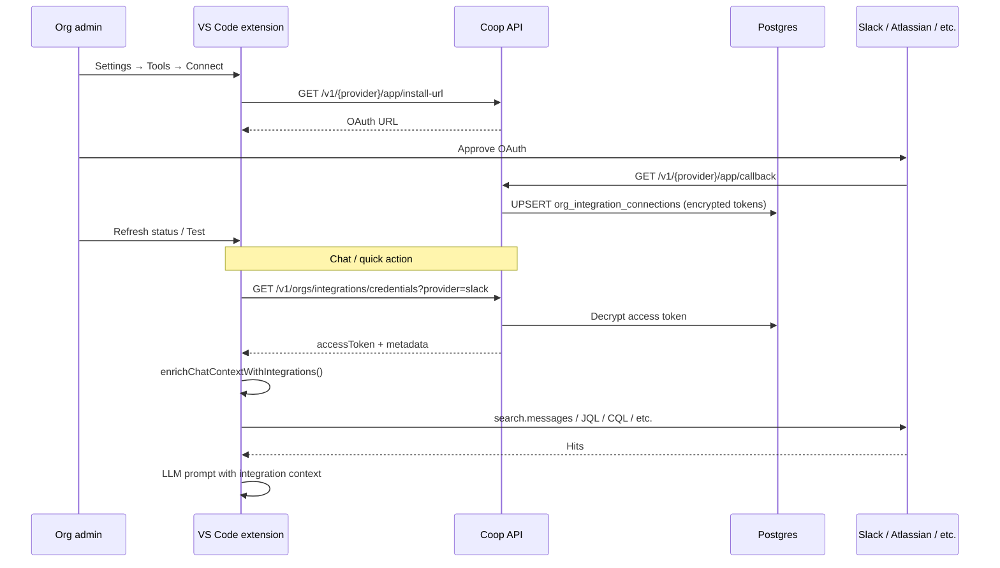

# Integration scope audit

End-to-end trace of how Coop orchestrates integration data access today, and where to add admin-controlled scope governance.

**Related:** [integration-scope-benchmark.md](./integration-scope-benchmark.md), [enterprise-integration-onboarding.md](./enterprise-integration-onboarding.md).

---

## 1. Flow: OAuth connect → token storage → context fetch → chat



**Key files**

| Step | File(s) |
|------|---------|
| OAuth install URL | `src/server/slackAppApi.ts`, `atlassianAppApi.ts`, `notionAppApi.ts`, `googleDocsAppApi.ts`, `teamsAppApi.ts` |
| Token storage | `src/server/integrationConnectionStore.ts`, `migrations/012_org_integration_connections.sql` |
| Extension cloud credentials | `src/extension.ts` (`integrationSecrets.setCloudFetcher`), `src/api/CoopBackendClient.ts` |
| Context orchestration | `src/context/integrationChatEnrichment.ts` |
| Chat session | `src/chat/CoopChatSession.ts` → `enrichChatContextWithIntegrations` |
| Admin portal status | `src/server/adminIntegrationsApi.ts`, `admin/src/app/(admin)/integrations/page.tsx` |

---

## 2. Per-provider table

| Provider | OAuth scopes (server) | Query API used | Filtering today | Gap vs allowlist |
|----------|----------------------|----------------|-----------------|------------------|
| **Slack** | Bot: `channels:read`, `channels:history`, `users:read`, `users:read.email`; User: `search:read`, `channels:history`, `groups:history`, `users:read`, `users:read.email` (`slackAppService.ts`) | `search.messages` via user token (`slackClient.ts`, `slackContext.ts`) | Repo/file/Jira-key query building only; **no channel allowlist** | **Critical** — workspace-wide search |
| **Jira** | Atlassian 3LO: `read:jira-work`, etc. (`atlassianAppService.ts`) | JQL search (`jiraContext.ts`, `jiraClient.ts`) | JQL built from repo terms; respects user's Jira permissions | No org-level project allowlist |
| **Confluence** | Same Atlassian token | CQL (`confluenceContext.ts`) | CQL from repo terms | No space allowlist |
| **Notion** | OAuth read content (`notionAppService.ts`) | Workspace search (`notionContext.ts`) | OAuth page selection at connect; search is workspace-scoped to token | Admin cannot change page set without re-connect |
| **Google Docs** | `drive.readonly` (`googleDocsAppService.ts`) | Drive query (`googleDocsContext.ts`) | Query terms only | No folder/shared-drive allowlist |
| **Teams** | Graph delegated (`teamsAppService.ts`) | Channel message search (`teamsContext.ts`) | Query terms only | No channel allowlist yet |
| **GitHub** | App install per repo | Code search (`codeHostContext.ts`) | Installation repos | Already repo-scoped at connect |

---

## 3. Enforcement hook (single entry point)

**Add:** `resolveIntegrationScope(orgId, provider)` in `src/server/resolveIntegrationScope.ts`

**Call sites (Phase B — Slack):**

| Caller | File | When |
|--------|------|------|
| Slack search | `src/context/slackContext.ts` → `fetchSlackSearchContext` | Before `client.searchMessages` — apply channel filter or return empty if blocked |
| Org scope API | `src/server/integrationApi.ts` | `GET /v1/orgs/integrations/scope` for extension |
| Admin scope API | `src/server/adminIntegrationScopeApi.ts` | GET/PUT scope, GET resources |
| Admin test | `src/server/adminIntegrationScopeApi.ts` | `POST .../test` — verify scoped search |
| Blast radius | `src/engines/blastRadiusAnalysis.ts` | Pass resolved scope into `fetchSlackSearchContext` |

**Pure helpers (shared):** `src/integrationScope/slackQuery.ts` — `applySlackChannelScope(queries, channelIds)`, `isSlackScopeBlocked(resolved)`.

---

## 4. Proposed DB schema

**New table:** `org_integration_policies` (migration `018_org_integration_policies.sql`)

```sql
CREATE TABLE org_integration_policies (
  org_id UUID NOT NULL REFERENCES organizations(id) ON DELETE CASCADE,
  provider VARCHAR(32) NOT NULL,
  policy JSONB NOT NULL DEFAULT '{}'::jsonb,
  updated_at TIMESTAMPTZ NOT NULL DEFAULT NOW(),
  PRIMARY KEY (org_id, provider)
);
```

**Slack policy shape:**

```json
{
  "version": 1,
  "mode": "allowlist",
  "channels": [
    { "id": "C01234567", "name": "engineering" },
    { "id": "C07654321", "name": "incidents" }
  ]
}
```

**Store:** `src/server/integrationScopePolicyStore.ts`

**Optional:** Store encrypted Slack bot token in connection `metadata.encryptedBotToken` for `conversations.list` channel picker (bot has `channels:read`; user token does not).

---

## 5. Admin API endpoints

| Method | Path | Purpose |
|--------|------|---------|
| GET | `/v1/admin/integrations/:provider/scope` | Current policy + status (`scopeRequired`, `active`) |
| PUT | `/v1/admin/integrations/:provider/scope` | Save allowlist; audit `admin.integration.scope.updated` |
| GET | `/v1/admin/integrations/:provider/resources` | Slack: channel list for picker (`?q=` search) |
| POST | `/v1/admin/integrations/:provider/test` | Test scoped access (Slack search in first allowed channel) |
| GET | `/v1/orgs/integrations/scope?provider=slack` | Extension: resolved scope for enforcement |

Extend `GET /v1/admin/integrations` response with `scopeStatus`: `none` | `required` | `active`.

---

## 6. Risk notes

| Risk | Detail | Mitigation |
|------|--------|------------|
| Slack `search:read` | User token can search all channels the user can see | Enterprise default-deny + `in:channel` query suffixes |
| Bot token not stored | Channel picker needs `channels:read` | Store encrypted bot token at OAuth callback |
| Pro/Free orgs | No scope gate today | Phase B: enforce only `plan === 'enterprise'` |
| Extension bypass | Context fetch runs client-side with token | Scope resolved server-side; extension must fetch scope before search |
| Google `drive.readonly` | Restricted scope; broad file access | Phase D folder allowlist + query `parents in` |
| Atlassian inherited ACL | App sees what user sees | Phase C project/space allowlist for defense in depth |
| Audit gap | No scope change events today | `admin.integration.scope.updated` |

---

## 7. Admin UI changes

| Component | Change |
|-----------|--------|
| `admin/src/components/IntegrationCard.tsx` | States: Connected / Scope required / Active; "Manage access" panel for Slack |
| `admin/src/lib/coopApi.ts` | `fetchIntegrationScope`, `saveIntegrationScope`, `fetchIntegrationResources`, `testIntegration` |
| `admin/src/lib/integrations.ts` | Extend `IntegrationStatus` with `scopeStatus`, `scopeSummary` |
| Jira/Confluence/Notion/Google | Stub: "Scope configuration coming soon" |

---

## 8. Files to change (implementation checklist)

**Phase A + B**

- `migrations/018_org_integration_policies.sql`
- `src/server/integrationScopePolicyStore.ts`
- `src/server/resolveIntegrationScope.ts`
- `src/integrationScope/slackQuery.ts`
- `src/server/adminIntegrationScopeApi.ts`
- `src/server/adminIntegrationsApi.ts` (wire routes, extend status)
- `src/server/adminApi.ts` (import scope handler)
- `src/server/integrationApi.ts` (org scope endpoint)
- `src/server/slackAppApi.ts` (store bot token for channel list)
- `src/server/integrationConnectionStore.ts` (metadata field for encrypted bot token)
- `src/api/slack/slackClient.ts` (`listChannels`)
- `src/context/slackContext.ts` (enforcement)
- `src/context/integrationChatEnrichment.ts` (pass scope)
- `src/chat/CoopChatSession.ts` (fetch scope)
- `src/api/CoopBackendClient.ts` (getIntegrationScope)
- `src/engines/blastRadiusAnalysis.ts` (pass scope)
- `admin/src/components/IntegrationCard.tsx`
- `admin/src/lib/coopApi.ts`
- `admin/src/lib/integrations.ts`
- `admin/src/app/api/integrations/scope/route.ts` (BFF proxy, optional)
