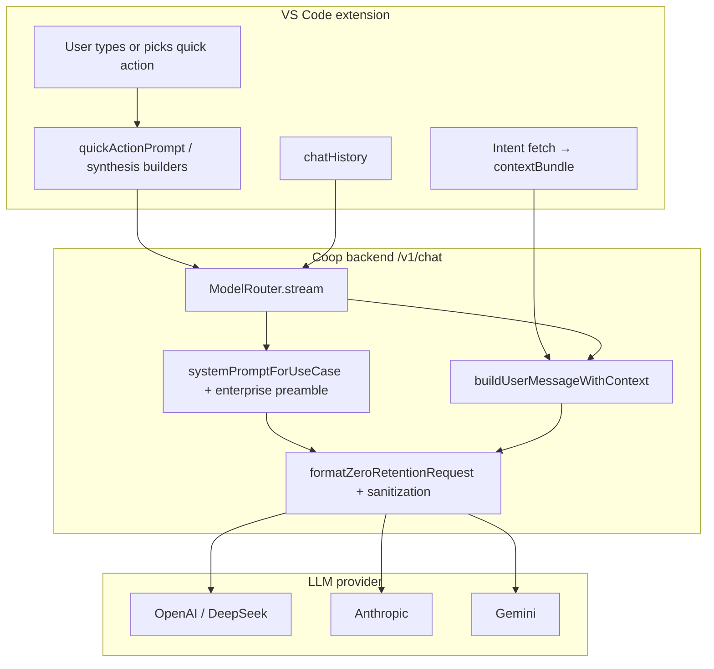

# Coop AI — LLM prompt architecture

This document explains **what CoopAI sends to language models**, how prompts are assembled, and the philosophy behind each layer. It is the reference for anyone tuning system prompts, debugging model behavior, or reviewing what enterprise code context leaves the extension.

**Source of truth in code:**

| Concern | Primary files |
|---------|---------------|
| System prompts & output contract | `src/prompts/systemPrompts.ts` |
| Enterprise confidentiality preamble | `src/api/requestFormatter.ts` |
| Message assembly & routing | `src/api/ModelRouter.ts` |
| User message + repo context | `src/prompts/systemPrompts.ts` → `buildUserMessageWithContext()` |
| Quick-action starter text | `src/prompts/quickActionPrompts.ts` |
| Decision / ownership synthesis | `src/prompts/decisionSynthesis.ts`, `src/prompts/ownershipSynthesis.ts` |
| Workspace saved prompts | `src/prompts/workspacePromptLibrary.ts` |
| Extension → API payload | `src/chat/CoopChatSession.ts`, `src/chat/SecureApiClient.ts` |
| Provider formatting & sanitization | `src/api/requestFormatter.ts`, `src/api/dataSanitization.ts` |
| Zero-retention headers & metadata | `src/api/zeroRetentionConfig.ts` |

---

## Philosophy

CoopAI treats every model call as **enterprise-confidential inference**, not open-ended chat. The prompt stack is designed around five principles:

### 1. Evidence over invention

Models are told to cite file paths, PR numbers, Jira keys, and people **only when that evidence appears in the supplied context**. System prompts for decision archaeology and ownership explicitly forbid fabricating URLs, ticket IDs, or names.

### 2. Context is structured, not dumped

Repository intelligence (graph fetches, manifest snippets, decision timelines) is attached in predictable XML-ish blocks (`<attached_context>`, `<graph_context>`, `<manifest_files>`) so models can locate evidence without parsing free-form prose.

### 3. Role and format are separated

- **Role prompts** define *who the model is* and *what task it performs* (comprehension, ownership, etc.).
- **Output contract** defines *how answers should look* in the UI (Cursor-style prose — bold section labels, clickable file paths, citation fences).
- Inline completion is the exception: raw code only, no markdown.

### 4. What the user sees ≠ what the model receives

The chat UI stores the user's message as typed (with optional `[quick-action]` prefix). Before the API call, CoopAI may **replace or wrap** that text with synthesis prompts, context blocks, and history — without changing what appears in the thread (except the displayed user bubble).

### 5. Zero retention by construction

Every provider request carries confidentiality language, retention metadata, `store: false` (where supported), and a sanitization pass over message bodies. Headers assert inference-only use. See [Zero retention & sanitization](#zero-retention--sanitization).

---

## End-to-end assembly



### Final message array (chat)

For a typical sidebar chat turn, `ModelRouter` builds:

```
[
  { role: "system",  content: <enterprise preamble> + <use-case system prompt> },
  ...history,                                        // prior user + assistant turns
  { role: "user",    content: <attached_context> + <user/synthesis message>, attachments? }
]
```

Default generation parameters (overridable per request):

| Parameter | Default (chat) | Default (inline) |
|-----------|----------------|------------------|
| `temperature` | `0.5` | `0.15` |
| `max_tokens` | `2000` | `96` (capped at 128) |

---

## Layer 1 — Enterprise confidentiality preamble

**File:** `src/api/requestFormatter.ts` → `ENTERPRISE_CONFIDENTIAL_SYSTEM_PROMPT`

Prepended to every system message. Establishes that:

- The request comes from a code intelligence tool (CoopAI).
- Code context is from a **private enterprise codebase**.
- The conversation must not be stored for training, used to improve models, or logged beyond diagnostics.

**Note:** `ModelRouter` embeds this text in the system message, and `injectZeroRetentionSystemPrompt()` prepends it again when formatting the provider request. In practice the model may see this block twice — harmless but redundant.

---

## Layer 2 — Use-case system prompt (role)

**File:** `src/prompts/systemPrompts.ts` → `systemPromptForUseCase(useCase)`

The `useCase` is chosen from the quick action (if any) or defaults to `chat`:

| Quick action ID | `useCase` | Role summary |
|-----------------|-----------|--------------|
| `understand-repo` | `comprehension` | Code architect — architecture, boundaries, risks |
| `trace-decision` | `decision_archaeology` | Code historian — why code exists, alternatives, trade-offs |
| `find-owner` | `ownership` | Org intelligence — true experts, escalation, knowledge transfer |
| `blast-radius` | `blast_radius` | Change impact — dependents, APIs, operational risk |
| `knowledge-gaps` | `knowledge_gaps` | Engineering health audit — unknowns, missing docs |
| *(none / free chat)* | `chat` | General CoopAI assistant |
| Inline autocomplete | `inline_completion` | Code completion engine — **no** output contract |

### Role prompt text (abridged)

**Comprehension**
> Expert code architect. Summarize architecture, key systems, boundaries, risks. Prefer supplied evidence. Cite file paths. State when context is stale or partial.

**Decision archaeology** (`DECISION_HISTORIAN_SYSTEM`)
> Code historian with commit, PR, Slack/Teams, Jira evidence. Explain business need, alternatives, trade-offs, limitations, domain experts. Cite sources explicitly. Never invent IDs or URLs. State confidence when evidence is thin.

**Ownership** (`OWNERSHIP_INTELLIGENCE_SYSTEM`)
> Organizational intelligence from ownership patterns, team structure, Slack availability. Identify true experts, SPOF risks, escalation paths, knowledge transfer targets. Distinguish authors from reviewers. Never invent people or statuses.

**Blast radius**
> Analyze change impact: dependents, APIs, integrations, operational risk. Be explicit about transitive effects and testing surfaces.

**Knowledge gaps**
> Audit missing docs, orphaned code, unclear ownership, open questions. List unknowns and evidence needed to reduce risk.

**General chat**
> CoopAI enterprise code intelligence assistant. Answer clearly using repo and org context. Cite paths; do not fabricate external links.

**Inline completion**
> Complete the current line or next 2–3 lines. Match indentation and style. One logical statement. No explanations, comments, or markdown. Return only completion text (empty if trivial).

---

## Layer 2b — Operating context (audience & environment)

**File:** `src/prompts/systemPrompts.ts` → `OPERATING_CONTEXT`

Appended (via `withOutputContract`) to every chat use-case system prompt **except** `inline_completion`. Establishes stable, always-true context about *who* is asking and *where* — so the model calibrates depth and tone without the user having to restate it each turn.

```
## Audience & environment
- The user is a professional software engineer using CoopAI inside their code editor.
- Assume strong technical fluency; skip basic explanations unless asked.
- Favor concrete, actionable answers: real file paths, code, and specifics over generic advice.
- Be concise and direct. This is a working tool, not a tutorial.
- Do not open with filler ("Great question", "Certainly", or restating the request).
- Omit sections with no evidence — never pad with generic advice.
```

This is intentionally placed in the **system prompt** (not the user message body): it is per-session truth, not per-turn intent, so it never pollutes what the user "said" or leaks into stored history.

---

## Layer 3 — Cursor-style output contract

**File:** `src/prompts/systemPrompts.ts` → `CURSOR_STYLE_OUTPUT_CONTRACT`

Appended to every chat use-case system prompt **except** `inline_completion`. Teaches models to write answers the `ChatProse` renderer can elevate into Cursor-quality UI. Each use case also gets a **`USE_CASE_STRUCTURE`** block (required section titles and grouping rules).

```
## Typography (not markdown)
- Main section titles: **Title** alone on its own line (blank line before).
- Subsection titles: same pattern nested under a main section.
- No # headings, tables, blockquotes, or README-style layout.
- Field labels (**Open question:**, **What to check:**) are bullets inside subsections — never top-level.

## Uniform response template
1. **Summary** or **Answer** — direct 1-2 sentence lead (always first).
2. Main sections from the use-case structure — omit empty sections.
3. Multi-item audits: one **subsection title** per item, then 2-4 bullets beneath.
```

**UI contract:** The webview parser (`src/webview/lib/chatProseParser.ts`) runs `normalizeCoopChatProse()` then parses into section headings, clickable file links, citation cards, and code blocks.

---

## Layer 4 — Conversation history

**Source:** `chatHistory` in `CoopChatSession`, sent as `history` on `/v1/chat`.

- Includes prior `user` and `assistant` turns from the active thread.
- Each entry: `{ role, content, attachments? }`.
- **Stored content** is what the user saw:
  - Free chat: raw message text.
  - Quick actions: `[action-id]` + compact display text + context chips (see below).
- History is sent **as-is** — it does not re-attach context blocks from earlier turns. Only the **latest** user message gets `buildUserMessageWithContext()`.

---

## Layer 5 — User message (what the model answers)

Three paths produce the final `message` field before context wrapping.

### A. Free-form chat

User text is sent verbatim (after context attachment). Example:

```
How does streaming work in ChatPanel?
```

### B. Quick action (display vs model prompt)

**File:** `src/prompts/quickActionPrompts.ts`

Quick actions split **what the user sees** from **what the model receives**:

| Export | Purpose |
|--------|---------|
| `quickActionDisplayText()` / `formatQuickActionHistoryContent()` | Chat bubble + thread history |
| `quickActionModelPrompt()` | User turn sent to the LLM (before synthesis/context wrapping) |

**In the chat UI**, the user bubble shows:

```
KNOWLEDGE GAPS                          ← tag from [knowledge-gaps]
Audit documentation and ownership gaps for this area.

file: Dockerfile · branch: main · repo: acme/widgets
```

Format instructions and evidence-source hints live in the **system prompt** (`USE_CASE_STRUCTURE`) and **model user turn** — not in the bubble.

| Action | Display (bubble) | Model turn adds |
|--------|------------------|-----------------|
| Understand repo | Repo-wide architecture intent | Entry files, graph context, repo-wide scope |
| Trace decision | Decision-tracing intent | PR/Slack/Teams/Jira evidence instructions |
| Find owner | Owner lookup intent | Identity links, Slack presence, escalation |
| Blast radius | Impact estimate intent | Dependency graph, local files, ops/API risk |
| Knowledge gaps | Gap audit intent | `knowledge_gap_scan`, Confluence/Notion/Google Docs |

**`useCase`** still switches the system prompt to the matching specialist role.

### C. Synthesis prompts (decision & ownership)

When context fetching produced a structured artifact, the user's text may be **replaced** by a synthesis user prompt before the API call (`CoopChatSession.continueChatAfterContext`):

**Trace decision** (when `decisionTimeline` exists):
```
## Task
<user question or default "Explain why the code at …">

## Code under investigation
```<snippet>```

## Evidence bundle
<formatted timeline: commits, PRs, Slack, Jira, etc.>

Synthesize from evidence only. Follow the required response structure in your system instructions.
```

**Find owner** (when `ownershipReport` exists):
```
## Task
<user question or default "Who truly owns …">

## Target path
- Repository, path, completeness

## Evidence bundle
<scores, experts, Slack, escalation data>

Synthesize from evidence only. Follow the required response structure in your system instructions.
```

**Understand repo** (when `repoSummary` exists): same pattern — evidence bundle + defer to system structure (no duplicate `## Output format` block).

The UI still shows the quick-action user bubble; the model receives the full synthesis document.

### D. Workspace saved prompts

**File:** `.coop/prompts.json` in the workspace

Templates support variables: `{{file}}`, `{{lines}}`, `{{owner}}`, `{{repo}}`, `{{branch}}`.

Optional `actionId` on a saved prompt sets `useCase` the same way as a quick action.

---

## Layer 6 — Attached context (`buildUserMessageWithContext`)

**File:** `src/prompts/systemPrompts.ts`

If there is no active file, no `contextBundle`, and no manifest file snippets, the user message is sent **without** a context wrapper.

Otherwise the user message becomes:

```xml
<attached_context>
repo: owner/repo
branch: main
<file path="src/api/chatApi.ts" lines="46-51" />

<manifest_files>
<file_content path="src/auth/handler.ts">
... full file content from zero-clone manifest ...
</file_content>
</manifest_files>

<graph_context>
[
  { "type": "decision_history", "data": { ... }, "stale": false },
  { "type": "ownership", "data": { ... } },
  ...
]
</graph_context>
</attached_context>

<user message or synthesis prompt>
```

### Context bundle contents

Populated by intent-driven fetches before chat (`runIntentFetch`). Typical entry types include decision history, ownership reports, dependency graphs, and integration data. The bundle is JSON-serialized into `<graph_context>`.

### Manifest file sanitization

Full file contents from `zeroClone.files` are inlined in `<manifest_files>`. In the JSON graph, those same files are **reduced to path + byteLength** only (content stripped) to avoid duplicating large blobs in the graph section.

---

## Layer 7 — Image attachments

Optional on the latest user turn only.

| Provider | Format |
|----------|--------|
| OpenAI / DeepSeek | `{ type: "text" }` + `{ type: "image_url", image_url: { url: dataUrl } }` |
| Anthropic | Image blocks (base64) + trailing text |
| Gemini | `inlineData` parts + text |

If the user sends images with an empty text field, content defaults to `"See attached image(s)."`.

---

## Provider-specific shaping

**File:** `src/api/requestFormatter.ts`

After assembly, `formatZeroRetentionRequest()` maps the unified message list to each provider:

| Provider | System handling | Notable body fields |
|----------|-----------------|---------------------|
| **OpenAI** | `messages[].role === "system"` | `store: false`; GPT-5/o-series use `max_completion_tokens` and omit custom temperature |
| **DeepSeek** | Same as OpenAI-compatible | `store: false` |
| **Anthropic** | All `system` messages joined into top-level `system` string | Standard `messages` array for user/assistant |
| **Gemini** | `systemInstruction.parts` + extra “must not be retained” line | `generationConfig.temperature`, `maxOutputTokens`; no web-search tools |

All providers receive sanitization + zero-retention metadata before the HTTP call.

---

## Zero retention & sanitization

### Headers & metadata (`zeroRetentionConfig.ts`)

Every request includes annotations such as:

- `usage_type: inference_only`
- `data_classification: enterprise_confidential`
- `retention_policy: none`
- `no_training: true`, `no_logging: true`

Provider-specific headers include `x-data-retention-policy: none`, `x-no-training: true`, etc.

### Payload sanitization (`dataSanitization.ts`)

Before the provider call, message content is scanned and redacted:

| Finding | Example pattern | Replacement |
|---------|-----------------|-------------|
| API keys / tokens | `sk-…`, `ghp_…`, `glpat-…` | `[REDACTED_SECRET]` / masked |
| Passwords / secrets in code | `password=…`, `token: …` | Redacted |
| Emails, phones, SSN | Standard formats | `[REDACTED_EMAIL]`, etc. |
| Internal paths | `/internal/…`, `/corp/…` | `[INTERNAL_PATH]` |
| Slack/Teams mentions | `@user`, `<@U123>` | `[REDACTED_MENTION]` |

Sanitization runs on the **outbound** payload only. It does not change what is stored in local chat history.

---

## Inline completion (separate path)

**Endpoint:** `POST /v1/completions/inline`

Does not use history. Message array:

```
system: ENTERPRISE_PREAMBLE + INLINE_SYSTEM (stricter completion rules)
user:   buildUserMessageWithContext(prefix + suffix around cursor, { file, languageId })
```

The user `message` is built by the autocomplete layer from editor prefix/suffix — not from chat input. Lower temperature, short `max_tokens`, single-turn only.

---

## What you see vs. what the model gets

| Element | In chat UI | Sent to model |
|---------|------------|---------------|
| User free text | Exact text | Same text after `<attached_context>` block |
| Quick action | Tag + compact intent + context chips | `quickActionModelPrompt()` (synthesis may replace message body for decision/ownership/repo summary) |
| Prior turns | Full thread | `history[]` without re-attached context |
| Repo / file / branch | Composer chips & explorer | `<attached_context>` metadata lines |
| Fetched integrations | Decision timeline / ownership **cards** | Raw JSON in `<graph_context>` + synthesis sections |
| System instructions | Hidden | Full system prompt + enterprise preamble |
| Output formatting rules | Rendered by `ChatProse` | `CURSOR_STYLE_OUTPUT_CONTRACT` in system prompt |
| Attachments | Thumbnails in user bubble | Multimodal content parts on latest user message |

---

## Tuning guide

### Change how models *behave* (reasoning quality)

Edit role text in `src/prompts/systemPrompts.ts` or the synthesis system prompts in `decisionSynthesis.ts` / `ownershipSynthesis.ts`.

To adjust audience/tone calibration across **all** chat roles at once, edit `OPERATING_CONTEXT` in `systemPrompts.ts` (applied via `withOutputContract`). Keep it short — it rides on every chat call.

### Change how models *format* answers (UI quality)

Edit `CURSOR_STYLE_OUTPUT_CONTRACT` in `systemPrompts.ts`. Keep in sync with `src/webview/lib/chatProseParser.ts` — the parser is the other half of the contract.

### Change what context models *see*

- Intent fetch types and bundle shape: `src/context/` pipeline + `CoopChatSession.runIntentFetch`
- Context XML structure: `buildUserMessageWithContext()` in `systemPrompts.ts`
- Quick-action display vs model text: `quickActionPrompts.ts` (`quickActionDisplayText`, `quickActionModelPrompt`)

### Change generation parameters

User settings → `CoopChatSession` → `/v1/chat` body → `ModelRouter` → provider client.

Defaults: temperature `0.5`, max tokens `2000`. Inline completion uses `0.15` / `96`.

---

## Example: full prompt for a knowledge-gaps turn

**User clicks "Knowledge Gaps" on `Dockerfile`.**

1. **UI user bubble:** `[knowledge-gaps]` tag + `Audit documentation and ownership gaps for this area.` + `file: Dockerfile · branch: main`
2. **Intent fetch** loads ownership, dependencies, Confluence search, and optional background `knowledge_gap_scan` into `contextBundle`.
3. **API `useCase`:** `knowledge_gaps`
4. **System message (conceptual):**

   ```
   [ENTERPRISE CONFIDENTIAL PREAMBLE]

   You audit engineering health: missing docs, orphaned code…
   [KNOWLEDGE_GAPS_SYSTEM + OPERATING_CONTEXT + CURSOR_STYLE_OUTPUT_CONTRACT + USE_CASE_STRUCTURE]
   ```

5. **User message (conceptual):**

   ```
   <attached_context>
   repo: acme/payments-api
   branch: main
   <file path="Dockerfile" />
   <knowledge_gap_scan found="3" …>…</knowledge_gap_scan>
   <confluence_pages>…</confluence_pages>
   </attached_context>

   Audit documentation, ownership, and operational unknowns for this file or area.
   Be direct and thorough; no preamble, filler, or restating this request.
   Context: file Dockerfile, branch main, repo acme/payments-api.
   Use attached knowledge_gap_scan findings, Confluence/Notion/Google Docs search results…
   ```

6. **Model response** is streamed back, normalized by `normalizeCoopChatProse()`, parsed by `ChatProse`, and rendered with subsection grouping.

---

## Related docs

- [LLM provider keys](./llm-provider-keys.md) — configuring OpenAI, Anthropic, Gemini, DeepSeek
- [Webhook backend](./webhook-backend.md) — async job path for heavy quick actions
- Webview UI policy: `.cursor/rules/webview-ui.mdc`

---

## Future: agent loop (Phase 5 scaffold)

Plain chat today uses a single-shot evidence fetch. A read-only **agent loop** (`src/api/agent/AgentOrchestrator.ts`, gated by `coopAI.chat.agentMode`) will iteratively call `search_code` and `read_file` tools against the existing graph/org APIs. Default: **off**.

---

*Last updated to reflect the ChatProse output contract and Cursor-style response renderer (2026).*
