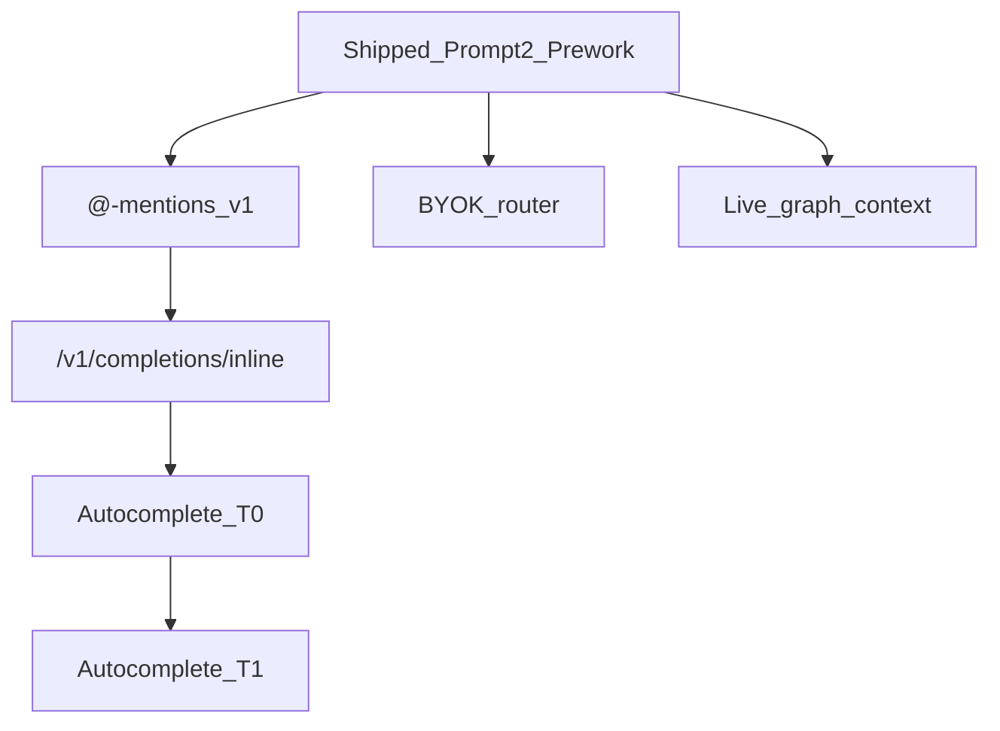

# CoopAI Roadmap

This document tracks what shipped in the Prompt 2 + pre-work pass, what is intentionally deferred, and the recommended order to build next. For API contracts, see [api-v1.md](./api-v1.md).

## Shipped (current baseline)

### Server (same host as graph / jobs / webhooks)

| Capability | Route / module | Notes |
|------------|----------------|-------|
| Multi-model router | `src/api/ModelRouter.ts` | Server-side; provider keys in env |
| Chat streaming | `POST /v1/chat` | SSE: `delta`, `done`, `error` |
| Inline completion | `POST /v1/completions/inline` | `useCase: inline_completion`; mock or provider keys |
| Health + LLM status | `GET /health` | `llm.mockMode`, `llm.configuredProviders` |
| Zero-retention routing | `requestFormatter`, `zeroRetentionConfig` | All provider calls |
| Mock dev mode | `COOP_LLM_MOCK=true` | No provider keys required |

### Extension

| Capability | Notes |
|------------|-------|
| Unified `coopAI.apiBaseUrl` | Chat, graph, jobs on one host; `jobsBaseUrl` deprecated |
| Live chat via `streamChat` | Calls `/v1/chat`; `coopAI.llm.enabled` |
| Provider / model / temperature settings | Keys stay on server, not in VS Code |
| Usage footer | Per-request + session cost estimate |
| Stream cancel | `AbortController` |
| Editor context menu | Trace, Find Owner, Blast Radius, Understand Repo, Knowledge Gaps |
| Open repo in editor (hybrid) | On remote explorer repo pick: local clone via `openFolder`, else GitHub Repositories (`coopAI.openRepoInEditor`) |
| Workspace prompt library | `.coop/prompts.json` + sidebar chips + Save / Run |
| API key UX | **Save API key** button (any length for local dev) |
| Inline autocomplete (T0) | `coopAI.autocomplete.enabled` default **off**; buffer-only ghost text |

### Explicitly not in scope of that pass

- File `@`-mentions in chat
- Graph-backed completion context (T1)

---

## Deferred work

### 1. File-only @-mentions in chat

**Goal:** Let users attach file paths (and optional line ranges) in the composer; resolve context from the remote graph without cloning the repo.

**Trigger to start:** `/v1/chat` stable (done) + extension `CoopBackendClient.graphSearch()` wired.

**Build list:**

- [ ] `@` picker in `ChatComposer` (debounced search)
- [ ] Extension RPC: search `GET /graph/:repoId/search?pattern=...`
- [ ] `MentionAttachment` on `chat:send` and in `V1ChatRequestBody.mentions[]`
- [ ] Resolve mentions → ownership, recent changes, decision signals (reuse context fetch types)
- [ ] Inject structured `<attached_context>` block (see `systemPrompts.buildUserMessageWithContext`)
- [ ] Caps: e.g. 3 files, token budget per request

**Out of v1:** `@symbol`, Slack @users, cross-repo mentions.

---

### 2. Autocomplete T0 (buffer-only) — shipped

**Goal:** Inline ghost-text completions using the open file only—no graph yet.

**Status:** Shipped. Default `coopAI.autocomplete.enabled` is **off** until users opt in.

**Build list:**

- [x] Implement inline route on server (reuse `ModelRouter`, `useCase: inline_completion`)
- [x] `CoopAutocompleteProvider` in extension (`registerInlineCompletionItemProvider`)
- [x] Debounce + cancel in-flight requests
- [x] Honor `coopAI.autocomplete.enabled` (default **off**)
- [x] Zero-retention headers (`x-use-case: code-completion-only`)
- [x] Strip markdown fences from model output
- [x] Copilot coexistence (auto-disable Copilot inline when Coop autocomplete is on)
- [x] Accept/reject telemetry (Tab accept, Escape reject, superseded)

**Prompt shape:** Narrow completion system prompt in `systemPrompts.ts` (`inline_completion`).

---

### 3. Autocomplete T1 (graph-backed)

**Goal:** Optional dependents / signature snippets from graph API when completing.

**Trigger to start:** T0 stable in production or dogfood.

**Build list:**

- [ ] Setting: `coopAI.autocomplete.useGraphContext`
- [ ] Server: include small graph slice in inline request (dependents, path metadata)
- [ ] Rate limits + degradation when graph offline

---

### 4. BYOK on the router (enterprise)

**Goal:** Route inference through customer-owned keys via existing `byokHandler.ts`.

**Trigger to start:** Enterprise pilot needs customer keys without CoopAI holding provider secrets.

**Build list:**

- [ ] Request field: `customerId` + BYOK provider
- [ ] `ModelRouter` delegates to `ByokHandler` when configured
- [ ] Audit log remains PII-free (already required for router)

---

### 5. Real provider cutover (leave mock)

**Goal:** Production chat uses live OpenAI / Anthropic / Gemini—not mock stream.

**Ops checklist:**

- [ ] Set `ANTHROPIC_API_KEY` (and others) on server; **do not** set `COOP_LLM_MOCK`
- [ ] Confirm `/health` → `"mockMode": false`
- [ ] `COOP_API_TOKEN` in prod; extension uses real CoopAI key (not placeholder)
- [ ] DeepSeek only with `COOP_LLM_ALLOW_UNAPPROVED=true` + legal sign-off

---

### 6. Context fetch → live graph (not placeholders)

**Goal:** Quick actions and chat context use real GitHub/graph data instead of `localContextDataFor` placeholders in `CoopChatSession`.

**Trigger to start:** Graph populated (webhooks or index jobs) for target repos.

**Build list:**

- [ ] Extension calls graph/jobs APIs for ownership, blame, dependents, decision history
- [ ] Align with `runFeatureFallback` / degradation matrix

---

### 7. Polish & docs

- [ ] `docs/roadmap.md` — this file (maintain as items ship)
- [ ] Local dev quickstart in README (server + F5 + `apiBaseUrl` + mock)
- [ ] Optional: quota alerts (needs billing API; not v1 cost footer)

---

## Recommended build order

```text
Now (verified)     →  mock chat + settings + prompts + context menu + Autocomplete T0
Next               →  @-mentions (files only) + live graph context for quick actions
Then               →  Autocomplete T1, BYOK on router
```



---

## How to task implementation

When ready for a row above, use a prompt like:

**@-mentions**

> Add file-only @-mentions in chat: picker, graph search via `apiBaseUrl`, `mentions[]` on `/v1/chat`, resolve ownership/changes into context. See `docs/roadmap.md` §1.

**Autocomplete T0**

> Shipped: `POST /v1/completions/inline` + extension `InlineCompletionItemProvider` (buffer-only). Default `coopAI.autocomplete.enabled` false. See `docs/roadmap.md` §2.

---

## Related docs

| Doc | Purpose |
|-----|---------|
| [api-v1.md](./api-v1.md) | Chat + inline request/response, auth, env vars |
| [webhook-backend.md](./webhook-backend.md) | Graph routes, webhooks, health |
| [job-queue.md](./job-queue.md) | Heavy scans (knowledge gaps, index) |
| [zero-retention-llm.md](./zero-retention-llm.md) | Enterprise LLM policy |
