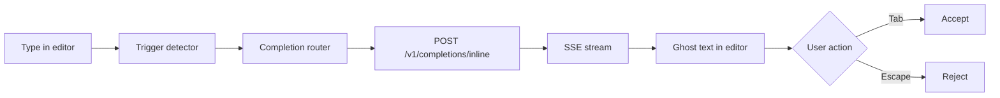

CoopAI inline autocomplete shows **ghost-text suggestions** as you type in the editor. Suggestions stream from the Coop API and appear via VS Code's `InlineCompletionItemProvider`.

The feature ships in production and is **on by default** (`coopAI.autocomplete.enabled: true`). Coop assigns **Mistral Codestral** for inline completions — see [Model assignments](/docs/model-assignments). Turn autocomplete off if you prefer not to use it; your choice is saved **globally** (User scope) so workspace folders cannot silently override it.

## Turn autocomplete off (or back on)

Autocomplete is controlled from **Settings → Preferences → Model & chat** — there is no toggle in the Coop sidebar header.

### Extension UI — Settings → Preferences → Model & chat

1. Open **CoopAI Settings** (gear icon in the sidebar title bar).
2. Go to **Preferences** → **Model & chat**.
3. Check or uncheck **Enable inline autocomplete**.
4. Click **Save model settings**.

<!-- figures ml -->

<!-- /figures -->

The **Autocomplete** row in the read-only assignment list shows **On** or **Off** based on that checkbox. Use **Enable live LLM chat** on the same screen to control chat, quick actions, and edit mode. There is no provider or model picker in production — see [Model assignments](/docs/model-assignments).

**Success:** With **Enable inline autocomplete** checked and saved, typing in an eligible file (e.g. `.ts`) shows ghost text after a short pause.

### File — VS Code User settings

Prefer **User** settings (not Workspace) so the preference stays consistent across folders:

```json
"coopAI.autocomplete.enabled": false
```

Coop strips legacy **workspace** `false` overrides on activate so an old folder setting cannot keep autocomplete off without your intent.

### Extension UI — Command Palette (optional)

Run **CoopAI: Toggle Autocomplete** to flip the global enabled flag without opening JSON settings.

Explicit opt-out is remembered (`coopAI.autocomplete.userDisabled` in extension global state) so index-discovery toasts do not re-enable autocomplete after you turn it off.

### Prerequisites

- Signed in under **Settings → Account** (Google, email, or SSO)
- File type is supported (code files; sensitive files such as `.env` are skipped)

<!-- figures -->

<!-- /figures -->

## How it works



1. **Context extraction** — Prefix, suffix, indentation, and surrounding lines from the open buffer.
2. **FIM (fill-in-the-middle)** — When `coopAI.autocomplete.useFim` is `true` (default), the extension sends `segments: { prefix, suffix }`. Production routing uses **Codestral** (Mistral) when the server has FIM keys configured; otherwise it falls back to chat-style completion.
3. **SSE streaming** — The extension requests `stream: true`. Tokens arrive incrementally so ghost text can appear before the full completion finishes.
4. **Client intelligence** — Hot Streak, Smart Throttle, request recycling, and multi-line detection tune when and how requests fire.

### Hot Streak

After you **Tab-accept** a suggestion, autocomplete stays snappy for ~8 seconds (up to 3 keystrokes). Debounce drops to 0–50 ms so the next completion feels immediate.

### Smart Throttle

Debounce adapts to your typing speed and rolling p95 latency:

- Fast typing → shorter debounce
- Elevated server latency → longer debounce to avoid wasted requests

### Request recycling

If you keep typing while a request is in flight, the extension **reuses the in-flight request** when the new prefix extends the old one, instead of firing a duplicate call.

### Multi-line detection

When the cursor is after `{`, `=>`, `(`, or on an empty line inside a block, the client requests up to **200 tokens** (vs 96 for single-line) and allows longer ghost-text spans.

## Keyboard shortcuts

| Action | macOS | Windows / Linux |
| --- | --- | --- |
| **Accept** suggestion | Tab | Tab |
| **Reject** suggestion | Escape | Escape |
| **Manual trigger** | Cmd+Shift+\\ | Ctrl+Shift+\\ |
| **Next** suggestion | Alt+] | Alt+] |
| **Previous** suggestion | Alt+[ | Alt+[ |

**Next / previous** apply only when `coopAI.autocomplete.showMultipleSuggestions` is `true`.

Run **CoopAI: Show Autocomplete Help** from the Command Palette for a quick reference.

## Settings

| Setting | Default | Description |
| --- | --- | --- |
| `coopAI.autocomplete.enabled` | `true` | Master switch — persisted at **global** scope |
| `coopAI.autocomplete.trigger` | `auto` | `auto` — debounced while typing; `manual` — hotkey only; `off` — no requests |
| `coopAI.autocomplete.useFim` | `true` | Send FIM `segments` for Codestral routing |
| `coopAI.autocomplete.useGraphContext` | `false` | Force indexed graph context on; when `false`, graph is still auto-attached when Deep-Index is ready (see below) |
| `coopAI.autocomplete.debounceMs` | `300` | Pause after typing before auto-trigger (0–2000) |
| `coopAI.autocomplete.requestTimeoutMs` | `1500` | Drop slow requests after this many ms (100–5000) |
| `coopAI.autocomplete.maxSuggestionLength` | `200` | Max characters in one suggestion (8–500) |
| `coopAI.autocomplete.showMultipleSuggestions` | `false` | Request and cycle ranked alternatives (Alt+[ / Alt+]) |
| `coopAI.autocomplete.projectImports` | `[]` | Extra import paths to bias project-style completions |

Advanced `coopAI.autocomplete.model` presets exist for developer tuning; production inline routing uses the assigned **Codestral** model regardless. See [Extension settings](/docs/extension-settings).

## GitHub Copilot

When **Coop autocomplete is on**, Coop automatically disables **Copilot inline suggestions** (`github.copilot.enable`) and restores your previous Copilot setting when you turn Coop autocomplete off. No prompt — Copilot chat and other features stay available; only competing inline ghost text is turned off.

When **Coop autocomplete is off**, Copilot inline behavior is unchanged.

## Graph context (indexed repos)

When your workspace repo is **Deep-Indexed** and index status is **ready** (SCIP or Zoekt available), Coop **automatically** attaches graph context to inline completions — even when `coopAI.autocomplete.useGraphContext` is `false` (the default).

- The extension sends `useGraphContext: true` with `repoId` and file path when the index is healthy
- The API attaches a short slice of **dependents** and **ownership** from the indexed graph (150 ms budget)
- Available on **all plans** when the repo is Deep-Indexed (free orgs: up to 3 repos)

Set `coopAI.autocomplete.useGraphContext` to `true` to **force** graph context on regardless of index health. Leave at `false` for auto when indexed.

Requires a connected, indexed repo in the admin portal. Set **Workspace** owner/repo/branch so `repoId` resolves correctly.

Response header `x-graph-context: degraded` means the graph slice timed out or was unavailable — completion still works from buffer context.

## FIM (fill-in-the-middle)

Traditional completion sends only text *before* the cursor. FIM sends both **prefix** (before cursor) and **suffix** (after cursor) so the model can fill the gap.

**Production routing** (when `segments.prefix` is present and `useFim` is enabled):

1. **Mistral Codestral** — assigned autocomplete model (`codestral-latest`) when `MISTRAL_API_KEY` is configured
2. **DeepSeek FIM** — fallback when only `DEEPSEEK_API_KEY` is set
3. **Chat fallback** — when FIM providers are unavailable

Set `coopAI.autocomplete.useFim` to `false` to always use chat-style `message` requests.

## Zero-retention routing

Inline requests use a dedicated path separate from chat:

```http
x-use-case: code-completion-only
```

See [Zero-retention LLM routing](/docs/zero-retention).

## Telemetry

| Event | Where | Purpose |
| --- | --- | --- |
| `completion.requested` | Server | Usage tracking, server-side latency |
| `completion.suggested` | Extension | Ghost text actually shown (CAR denominator) |
| `completion.accepted` | Extension | Tab accept (CAR numerator) |
| `completion.rejected` | Extension | Escape or superseded suggestion |
| `completion.performance` | Extension | Batched client p50/p95 snapshots |

Org admins can view org completion metrics in the [admin portal](https://admin.coop-ai.dev/analytics) → **Completions** tab. Members see personal usage on **My Usage** → **Completions**.

## Troubleshooting

| Problem | Fix |
| --- | --- |
| **No ghost text** | Confirm **Enable inline autocomplete** is checked in **Settings → Preferences → Model & chat** and saved; sign in under **Settings → Account** |
| **Nothing on manual trigger** | Enable autocomplete first; use Ctrl+Shift+\\ (Cmd+Shift+\\ on macOS) |
| **Slow or missing suggestions** | Increase `requestTimeoutMs`; check network; self-hosted API needs `MISTRAL_API_KEY` for Codestral FIM |
| **Completions in strings/comments** | By design — trigger detector skips comment and string contexts |
| **Graph context empty** | Deep-Index the repo in admin portal; confirm index status is **ready** in Settings → Indexing; check Workspace owner/repo/branch; set `coopAI.autocomplete.useGraphContext` to `true` to force on |
| **Workspace kept it off** | Coop clears workspace `false` overrides on activate; set `coopAI.autocomplete.enabled` in **User** settings |

More fixes: [Troubleshooting](/docs/troubleshooting#autocomplete).

## API

Direct API usage: [API reference — Inline completion](/docs/api-reference#inline-completion).

## Next steps

- [Model assignments](/docs/model-assignments) — per-feature models and settings UI
- [Extension settings](/docs/extension-settings)
- [Getting started](/docs/getting-started)
- [Edit mode](/docs/edit-mode) — `/edit` patches with apply and undo
