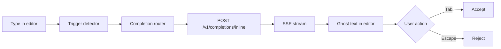

Coop AI inline autocomplete shows **ghost-text suggestions** as you type in the editor. Suggestions stream from the Coop API and appear via VS Code's `InlineCompletionItemProvider`.

The feature ships in production but is **off by default**. Enable it when you want Coop-powered completions alongside chat and quick actions.

## Enable autocomplete

### 1. File — VS Code settings (User or Workspace)

Add or change:

```json
"coopAI.autocomplete.enabled": true
```

**Success:** Coop sidebar shows **Autocomplete On**. Typing in an eligible file (e.g. `.ts`) shows ghost text after a short pause.

### 2. Extension UI — Command Palette (optional)

Run **CoopAI: Toggle Autocomplete** to flip `coopAI.autocomplete.enabled` without opening JSON settings.

### Prerequisites

- Valid Coop API key in **Settings → Account**
- **Test connection** succeeds (`GET /health`)
- File type is supported (code files; sensitive files such as `.env` are skipped)

## How it works



1. **Context extraction** — Prefix, suffix, indentation, and surrounding lines from the open buffer.
2. **FIM (fill-in-the-middle)** — When `coopAI.autocomplete.useFim` is `true` (default), the extension sends `segments: { prefix, suffix }`. The server routes to Codestral or DeepSeek FIM when keys are configured; otherwise it falls back to chat-style completion.
3. **SSE streaming** — The extension requests `stream: true`. Tokens arrive incrementally so ghost text can appear before the full completion finishes.
4. **Client intelligence** — Hot Streak, Smart Throttle, request recycling, and multi-line detection tune when and how requests fire.

### Hot Streak

After you **Tab-accept** a suggestion, autocomplete stays snappy for ~8 seconds (up to 3 keystrokes). Debounce drops to 0–50 ms so the next completion feels immediate.

### Smart Throttle

Debounce adapts to your typing speed and rolling p95 latency:

- Fast typing → shorter debounce
- Elevated server latency → longer debounce to avoid wasted requests

### Request recycling

If you keep typing while a request is in flight, the extension **reuses the in-flight request** when the new prefix extends the old one, instead of firing a duplicate call.

### Multi-line detection

When the cursor is after `{`, `=>`, `(`, or on an empty line inside a block, the client requests up to **200 tokens** (vs 96 for single-line) and allows longer ghost-text spans.

## Keyboard shortcuts

| Action | macOS | Windows / Linux |
| --- | --- | --- |
| **Accept** suggestion | Tab | Tab |
| **Reject** suggestion | Escape | Escape |
| **Manual trigger** | Cmd+Shift+\\ | Ctrl+Shift+\\ |
| **Next** suggestion | Alt+] | Alt+] |
| **Previous** suggestion | Alt+[ | Alt+[ |

**Next / previous** apply only when `coopAI.autocomplete.showMultipleSuggestions` is `true`.

Run **CoopAI: Show Autocomplete Help** from the Command Palette for a quick reference.

## Settings

| Setting | Default | Description |
| --- | --- | --- |
| `coopAI.autocomplete.enabled` | `false` | Master switch for inline ghost-text autocomplete |
| `coopAI.autocomplete.trigger` | `auto` | `auto` — debounced while typing; `manual` — hotkey only; `off` — no requests |
| `coopAI.autocomplete.useFim` | `true` | Send FIM `segments` for Codestral / DeepSeek routing |
| `coopAI.autocomplete.useGraphContext` | `false` | Include indexed dependency graph context (**Pro**; see below) |
| `coopAI.autocomplete.copilotPolicy` | `warn` | `warn` — UI warning when Copilot is installed; `disable-when-copilot` — yield to Copilot |
| `coopAI.autocomplete.model` | `haiku` | Fast preset: `haiku`, `gpt35`, or `custom` |
| `coopAI.autocomplete.customModel` | `""` | Model id when `model` is `custom` |
| `coopAI.autocomplete.debounceMs` | `300` | Pause after typing before auto-trigger (0–2000) |
| `coopAI.autocomplete.requestTimeoutMs` | `400` | Drop slow requests after this many ms (100–2000) |
| `coopAI.autocomplete.maxSuggestionLength` | `200` | Max characters in one suggestion (8–500) |
| `coopAI.autocomplete.showMultipleSuggestions` | `false` | Request and cycle ranked alternatives (Alt+[ / Alt+]) |
| `coopAI.autocomplete.projectImports` | `[]` | Extra import paths to bias project-style completions |

See [Extension settings](/docs/extension-settings) for Account, Tools, and Workspace settings.

## GitHub Copilot coexistence

If **GitHub Copilot** or **GitHub Copilot Chat** is installed, both extensions can register inline completion providers. VS Code may show competing ghost text.

| `copilotPolicy` | Behavior |
| --- | --- |
| `warn` (default) | Coop autocomplete runs; a one-time warning suggests changing policy |
| `disable-when-copilot` | Coop autocomplete disables while Copilot extensions are installed |

**Recommendation:** If Copilot is your primary inline tool, set `disable-when-copilot`. If you prefer Coop graph context (Pro + `useGraphContext`), keep `warn` or uninstall Copilot inline.

## Graph context (Pro)

When `coopAI.autocomplete.useGraphContext` is `true` and your org is on **Pro** or **Enterprise**:

- The extension sends `useGraphContext: true` with `repoId` and file path
- The API attaches a short slice of **dependents** and **ownership** from the indexed graph (150 ms budget)
- Free plans skip graph context server-side

Requires a connected, indexed repo in the admin portal. Set **Workspace** owner/repo/branch so `repoId` resolves correctly.

Response header `x-graph-context: degraded` means the graph slice timed out or was unavailable — completion still works from buffer context.

## FIM (fill-in-the-middle)

Traditional completion sends only text *before* the cursor. FIM sends both **prefix** (before cursor) and **suffix** (after cursor) so the model can fill the gap.

**Server routing** (when `segments.prefix` is present and `useFim` is enabled):

1. **Mistral Codestral** — `MISTRAL_API_KEY` → `codestral-latest`
2. **DeepSeek FIM** — `DEEPSEEK_API_KEY` → `deepseek-chat`
3. **Chat fallback** — Anthropic Haiku or OpenAI mini via `message` prompt

Set `coopAI.autocomplete.useFim` to `false` to always use chat-style `message` requests.

## Zero-retention routing

Inline requests use a dedicated path separate from chat:

```http
x-use-case: code-completion-only
```

See [Zero-retention LLM routing](/docs/zero-retention).

## Telemetry

| Event | Where | Purpose |
| --- | --- | --- |
| `completion.requested` | Server | Token billing, server-side latency |
| `completion.suggested` | Extension | Ghost text actually shown (CAR denominator) |
| `completion.accepted` | Extension | Tab accept (CAR numerator) |
| `completion.rejected` | Extension | Escape or superseded suggestion |
| `completion.performance` | Extension | Batched client p50/p95 snapshots |

Org admins can view completion metrics in the [admin portal](https://admin.coop-ai.dev/analytics) → **Completions** tab.

## Troubleshooting

| Problem | Fix |
| --- | --- |
| **No ghost text** | Set `coopAI.autocomplete.enabled` to `true`; confirm API key and **Test connection** |
| **Nothing on manual trigger** | Enable autocomplete first; use Ctrl+Shift+\\ (Cmd+Shift+\\ on macOS) |
| **Copilot wins** | Set `copilotPolicy` to `disable-when-copilot`, or disable Copilot inline |
| **Slow or missing suggestions** | Increase `requestTimeoutMs`; check network; self-hosted API needs `MISTRAL_API_KEY` or `DEEPSEEK_API_KEY` for FIM, or `ANTHROPIC_API_KEY` / `OPENAI_API_KEY` for chat fallback |
| **Completions in strings/comments** | By design — trigger detector skips comment and string contexts |
| **Graph context empty** | Pro plan + indexed repo; check Workspace owner/repo/branch |

More fixes: [Troubleshooting](/docs/troubleshooting#autocomplete).

## API

Direct API usage: [API reference — Inline completion](/docs/api-reference#inline-completion).

## Next steps

- [Extension settings](/docs/extension-settings)
- [Getting started](/docs/getting-started)
- [Owner's Manual — Inline complete](/manual#inline-complete-and-edit-selection)
