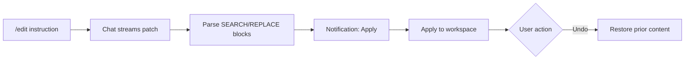

CoopAI **edit mode** turns natural-language instructions into **search-replace patches** you review and apply in VS Code. Use it when you want in-file changes without an autonomous agent rewriting your tree.

Edit mode ships in production. It uses the same chat composer as quick actions — no separate panel.

## When to use edit mode

| Use edit mode | Use plain chat instead |
| --- | --- |
| Refactor a highlighted block | Architecture or ownership questions |
| Fix a bug in the open file | Cross-tool context (Slack, Jira) |
| Apply a localized change with review | Exploratory "what if" analysis |

Edit mode routes to the `code_edit` use case and expects **patch blocks** in the model response — not prose-only answers.

**Model:** Coop assigns **OpenAI GPT-5 mini** for `/edit`, `/patch`, and `/fix` in production. See [Model assignments](/docs/model-assignments).

## Slash commands

Type `/` in the composer to see edit commands:

| Slash | Aliases | What it does |
| --- | --- | --- |
| `/edit` | `/patch`, `/fix` | Generate search-replace patches for your instruction |

**Examples:**

```
/edit add null check before dereferencing user
```

```
/patch rename handleError to onRequestError in this function
```

```
/fix off-by-one in the loop bounds
```

All three resolve to the same **edit** composer mode. Text after the command is your instruction.

## Selection and file context

Coop attaches editor context automatically:

| Context | Setting | Default |
| --- | --- | --- |
| **Selected lines** | `coopAI.includeSelection` | `true` |
| **Active file path** | `coopAI.includeActiveFile` | `true` |

**Best practice:** highlight the code you want changed, then run `/edit <instruction>`. With no selection, Coop uses the active file and your instruction.

Workspace **owner / repo / branch** (Settings → Workspace) help resolve indexed-repo context when the repo is Deep-Indexed.

## How it works



1. **Request** — You send `/edit …` in chat. Coop emits `edit.requested` telemetry and streams a response using the `code_edit` system prompt.
2. **Parse** — When the response completes, the extension parses `File:` headers and `<<<<<<< SEARCH` / `>>>>>>> REPLACE` hunks.
3. **Review** — A VS Code notification shows **Patch ready — N file(s) (M edits)** with **Apply** and **Reject**. Dismissing the notification (X) keeps the patch pending — run **CoopAI: Apply Patch** later.
4. **Apply** — Click **Apply** or run **CoopAI: Apply Patch** (`coopAI.applyPatch`). Changed files are written in the workspace. SEARCH blocks tolerate minor whitespace drift (indent/trim) when an exact match is not found.
5. **Undo** — After apply, the success notification includes **Undo**, or run **CoopAI: Undo Last Patch** (`coopAI.undoLastPatch`).
6. **Retry** — If apply fails, click **Retry** on the error notification or run **CoopAI: Retry Last Patch** (`coopAI.retryLastPatch`). Coop re-opens the pending patch or sends a follow-up `/edit` turn asking the model to fix SEARCH blocks.

If parsing fails, no patch is staged — check the chat response for valid patch formatting.

## Patch format

The model returns one or more files with search-replace hunks:

```text
File: src/auth/login.ts

<<<<<<< SEARCH
if (!user) {
  return null;
}
=======
if (!user) {
  throw new Error("User required");
}
>>>>>>> REPLACE
```

- **`File:`** — Repository-relative path (backticks optional).
- **`<<<<<<< SEARCH`** — Exact text to find (must match the file, including indentation).
- **`=======`** — Separator between search and replace.
- **`>>>>>>> REPLACE`** — Replacement text.

Multi-file edits include multiple `File:` sections. Each file can have multiple hunks.

## Apply and undo

### Apply

| Method | Surface |
| --- | --- |
| **Apply** button | VS Code notification after patch is parsed |
| **CoopAI: Apply Patch** | Command Palette (`coopAI.applyPatch`) |
| **Reject** button | Notification — clears pending patch |
| **CoopAI: Reject Patch** | Command Palette (`coopAI.rejectPatch`) |
| **CoopAI: Retry Last Patch** | Command Palette (`coopAI.retryLastPatch`) — re-show pending patch or regenerate after apply failure |

**Success:** Notification shows `Applied patch to N file(s).` with an **Undo** action.

### Undo

| Method | Surface |
| --- | --- |
| **Undo** button | On the apply-success notification |
| **CoopAI: Undo Last Patch** | Command Palette (`coopAI.undoLastPatch`) |

Undo restores file contents from before the last successful apply. Only the **most recent** apply is undoable.

## Settings

| Setting | Default | Description |
| --- | --- | --- |
| `coopAI.includeSelection` | `true` | Include the current editor selection in chat context |
| `coopAI.includeActiveFile` | `true` | Include the active file path in chat context |

See [Extension settings](/docs/extension-settings) for Workspace and Preferences.

## Telemetry

| Event | When |
| --- | --- |
| `edit.requested` | `/edit`, `/patch`, or `/fix` sent |
| `edit.patch_parsed` | Valid patch blocks parsed |
| `edit.patch_applied` | Apply succeeded |
| `edit.patch_undone` | Undo succeeded |
| `edit.patch_failed` | Parse, apply, or undo error |
| `edit.patch_rejected` | User explicitly rejected the patch (**Reject** or **CoopAI: Reject Patch**) |

Org admins see edit metrics in the [admin portal](https://admin.coop-ai.dev/analytics). Members see personal usage on **My Usage**.

## Troubleshooting

| Problem | Fix |
| --- | --- |
| **No Apply notification** | Model response may lack valid `File:` + SEARCH/REPLACE blocks — rephrase or narrow the selection |
| **Apply failed — search text not found** | SEARCH block must match the file exactly; regenerate with the selection highlighted |
| **No patch pending** | Run `/edit` first; only one pending patch is held at a time |
| **Nothing to undo** | Undo only covers the last successful apply |
| **Wrong file edited** | Confirm selection and active file; check Workspace repo/branch |

More fixes: [Troubleshooting](/docs/troubleshooting).

## Next steps

- [Inline autocomplete](/docs/autocomplete) — ghost-text completions (on by default)
- [Extension settings](/docs/extension-settings)
- [Owner's Manual — Edit selection](/manual#inline-complete-and-edit-selection)
